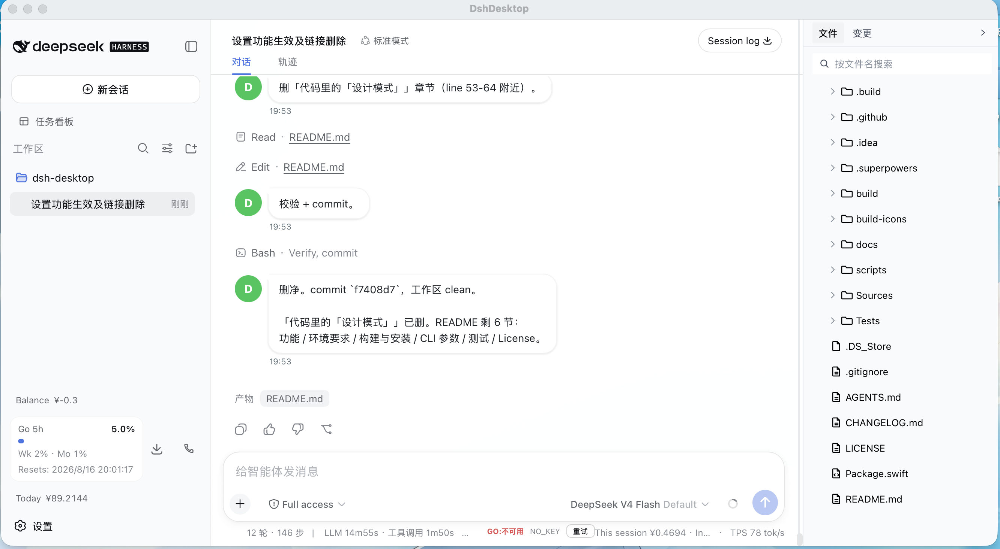

# DshDesktop

一个原生 macOS 包装器，把 [`dsh --profile web`](https://github.com/deepseek-ai/deepseek-harness) 的 Web UI 装进 `WKWebView`。wrapper 以子进程方式拉起 dsh、显示 Web UI，并常驻菜单栏——尽量不打扰你的工作。

[](https://github.com/coderstory/dsh-desktop/actions/workflows/build.yml)



## 功能

- **原生窗口** — SwiftUI + `WKWebView`；原生 macOS 交通灯、拖动、缩放等。
- **常驻菜单栏** — 关掉窗口，wrapper 仍在菜单栏存活；点图标 →「Show dsh」即可重新打开。
- **单实例** — 再启动一份会聚焦已有窗口并退出。
- **自动拉起或复用** — 若 dsh 已在配置端口提供服务，wrapper 直接连上而不拉起；否则自行拉起 dsh。
- **健康监测** — dsh 中途挂掉时，wrapper 侦测到端口失效并弹出「dsh stopped responding」遮罩，附 Restart 按钮。
- **可信的 agent-finished 通知** — dsh agent 完成响应时弹一条 macOS 横幅（在 Settings 中开关）。通知路径由配套的 dsh 插件 `dsh-desktop-bridge` 提供：插件监听 dsh driver 的 `agent/status` 事件，在 `busy → idle` 转换时通过 unix-domain socket 通知 wrapper；wrapper 负责调 `UNUserNotificationCenter` 弹原生横幅。**没有插件时通知路径回退到老的 DOM `data-streaming` 探针**（早期版本的不可靠路径，仍保留以做向下兼容）。
- **自动检测 + 提示安装插件** — 启动时 wrapper 读取 `~/.dsh/profiles/web/cordis.patch.yml` 检查插件状态：缺失/禁用/版本不匹配/路径损坏分别弹对应 alert；点 alert 里的 **Install** / **Re-enable** 按钮 wrapper 会自动写 patch。控制菜单 ▸ **Check Bridge Plugin…** 可以随时手动重检。
- **诊断报告** — `dsh ▸ Save Diagnostic Report…` 把 wrapper 状态（prefs、进程状态、最近 os.log）写成纯文本快照，便于提交 bug 报告。
- **更新 dsh** — `dsh ▸ Update dsh…` 执行 `npm update -g @deepseek-ai/dsh` 并反馈结果。
- **开机启动** — 在 dsh 菜单切换；由 `SMAppService` 支撑（现代做法，不用已废弃的 SMLoginItem）。
- **本地化** — 英文 + 简体中文。

## 与 `dsh-desktop-bridge` 插件的关系

通知路径走的是 dsh ↔ wrapper 的 unix-domain socket（`~/Library/Application Support/ai.deepseek.dsh.desktop/bridge.sock`），不是 wrapper 自己读 dsh web UI 的 DOM。**没有插件时通知不可靠**（旧的 DOM 探针在工具调用间隙会误判）。详见配套仓库 [coderstory/dsh-plugins/dsh-desktop-bridge](https://github.com/coderstory/dsh-plugins/tree/main/dsh-desktop-bridge)。

首次启动时 wrapper 会弹 alert 提示安装/启用插件；点 alert 里的 Install 之后**手动重启 dsh** 让 patch 生效（wrapper 不会自动重启 dsh，避免误杀你正在跑的任务）。

## 环境要求

- macOS 25.0+（Tahoe 或更新）
- Xcode 27+ 工具链（Swift 6.4）
- 已安装 `dsh` 且在 shell 的 `$PATH` 里

## 构建与安装

```bash
./scripts/bundle.sh     # swift build -c release + 组装 DshDesktop.app
./scripts/sign.sh       # ad-hoc 签名
./scripts/dmg.sh        # 可选：打 UDZO DMG 用于分发

# 直接从构建产物运行：
open build/DshDesktop.app

# 或安装到 /Applications：
cp -R build/DshDesktop.app /Applications/
open /Applications/DshDesktop.app
```

## CLI 参数

| 参数 | 作用 |
|---|---|
| `--port <N>` | dsh 监听的 TCP 端口（默认 3080，或来自 Preferences） |
| `--dsh-path <P>` | dsh 可执行文件的绝对路径；跳过基于 shell 的 `which` 查找（若你的 `PATH` 设在 `~/.zshrc` 而 wrapper 的 login shell 不 source 它，请用它） |
| `--no-spawn` | 不拉起 dsh；连到 `--port` 上由外部管理的 dsh |
| `--debug` | 输出详细 os.log（subsystem `ai.deepseek.dsh.desktop`） |
| `--help`、`-h` | 打印帮助并退出 |

未知参数会被静默忽略（这样测试运行器可以传 `--test-bundle-path` 等）。

## 测试

```bash
swift test                          # 70 个测试，12 个 suite
swift test -Xswiftc -warnings-as-errors
```

> 配套插件仓库 [dsh-plugins/dsh-desktop-bridge](https://github.com/coderstory/dsh-plugins/tree/main/dsh-desktop-bridge) 配有自己的 18 个测试（10 个单元 + 8 个 sandbox 端到端，沙箱脚本会**真实**起一个隔离 DSH_HOME 里的 dsh，验证插件能加载且不崩）。

## 故障排查

| 症状 | 原因 / 修复 |
|---|---|
| 启动卡在 "Starting…"（点 Install/Skip 都卡）| 已知修复 commit `13476f8`：早期版本在 `init()` 里调 `NSAlert.runModal()`，与 SwiftUI 早期启动的 runloop race 把整个 launch 卡住。修复后 init() 走非阻塞路径（只检测 + `.notInstalled` 自动写 patch，不弹 alert）；交互式 alert 仍保留在控制菜单 ▸ Check Bridge Plugin… 中，那里 runloop 已经稳定。`Tests/DshDesktopTests/LaunchPathTests.swift` 锁住"init() 不许引用 NSAlert/runModal"以防回归。 |
| 通知乱发（在工具调用之间、状态抖动时弹通知）| 老的 DOM `data-streaming` 探针路径。装上 dsh-desktop-bridge 插件并启用（首次启动 wrapper 会自动写 patch 到 `~/.dsh/profiles/web/cordis.patch.yml`），然后**手动重启 dsh**让 patch 生效。 |
| dsh 启动失败 "failed to read overlay ... cordis.patch.yml" | 用户的 dsline-chat 插件 cordis.patch.yml 被覆写为空 `[]`。修复：写入 README 里的正确内容 |
| GUI app 找不到 dsh | DshLocator 用 login shell 查找；如果还失败，看 os.log 的 `dsh-desktop` subsystem |
| 端口 3080 已占用 | wrapper 的 pre-check 应检测到并 releaseOwnership 复用 |
| 单实例守护失效 | 查 `Bundle.main.bundleIdentifier` 是否是 `ai.deepseek.dsh.desktop`（Info.plist）|
| bg-throttle 没加载 | dsh 启动日志里找 `[bg-throttle v2] loaded`；patch 文件路径要绝对 |

## License

MIT。见 `LICENSE`。
